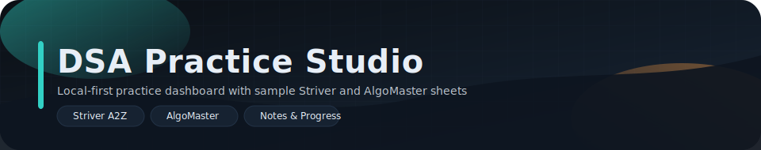

<p align="center">
  
</p>

<p align="center">
  
  
  
  
</p>

<p align="center">
  Local-first LeetCode practice dashboard with sample Striver and AlgoMaster sheets.
</p>

<p align="center">
  DSA Practice Studio is a LeetCode study tracker built for intentional practice: sync unit progress, log notes, and lean on floating focus widgets while staying entirely local-first.
</p>

<p align="center">
  ⭐ <strong>Find this helpful?</strong> Please star the repo so others can discover the LeetCode workflow and we can keep improving the dashboard.
</p>

## Table of contents

- [Features](#features)
- [Quickstart](#quickstart)
- [Usage guide](#usage-guide)
- [Widget studio](#widget-studio)
- [Revision panel](#revision-panel)
- [Admin console](#admin-console)
- [Tracking logic](#tracking-logic)
- [Import & export](#import--export)
- [CLI](#cli)
- [Data storage](#data-storage)
- [Project layout](#project-layout)
- [Contributing](#contributing)

## Features

- Multi-sheet LeetCode/DSA reviews (Striver + AlgoMaster) with a persistent sheet switcher.
- Unit-chapter grouping, adjustable filters, and streak-friendly progress tracking for purposeful practice.
- Star, note, and categorize questions with easy access to the notes hub and bookmarked revisions.
- Widget overlay (clock, timer, stopwatch) plus the draggable `W` launcher keep focus helpers visible on screen.
- Import/export flows across UI and CLI (CSV/Excel + JSON) so work stays synchronized and sharable.
- Local-first storage in SQLite and JSON keeps your data private and git-ignored while also being exportable.

## Tech stack

- Python 3.9+
- Flask
- SQLite (unit status + UI/view state)
- JSON (questions, notes, progress)
- OpenPyXL (Excel import)
- Vanilla HTML/CSS/JS dashboard

## Quickstart

```bash
python3 -m venv .venv
source .venv/bin/activate
pip install -r requirements.txt
python3 app.py
```

Open `http://127.0.0.1:8000`, switch sheets using the header tabs, and revisit the bundled `samples/` directory whenever you want to reset the workspace.

## Usage guide

### Dashboard (learner view)

- Switch sheets from the header tabs and keep your streak by unlocking the next chapter.
- Use the search bar + filters to focus on units, statuses, or difficulty and widen the pace with zero lag.
- Mark questions done, star the ones you want to revisit, and jot notes inline to track context.
- Use the Notes modal to edit every saved note and keep all thoughts exportable.
- Gray link icons signal a missing URL so you can flag what needs research.
- Click the floating `W` launcher in the bottom-right corner. The widget dialog exposes the clock, timer, stopwatch toggles, your timer preset, and the overlay display—every helper runs independently while the overlay can be hidden when you want a clean workspace.

### Revision panel

- Review all notes and starred questions in one place at `/revision`.
- Use search to filter notes or bookmarked questions.
- Unstar items when you are done with them.

### Admin console

- `/admin` hosts the command center and configuration tools.
- Tracking panel shows momentum, heatmap, and sheet health.
- Sheet Management handles create/rename/import/export and bulk actions.
- Unit Management refactors unit/chapter names and bulk difficulty.
- UI Management controls labels, layout, themes, and link fallback rules.
- Troubleshooting provides health checks and recovery actions.

### Tracking logic

- Heatmap counts only questions marked done.
- Heatmap scope is the currently active sheet.
- Momentum counts solved items over the last 7 days.

### Import & export

- Import is CSV or Excel only.
- Export any sheet as CSV or JSON.
- UI settings can be exported/imported as JSON in Admin → UI Management.

## Widget studio

- Visit `/widgets` or tap the Widget Studio link to read how the floating `W` launcher, clock, timer, and stopwatch work together on the dashboard.
- The dialog keeps every widget toggle, timer preset, and overlay visibility control in one place, and the overlay keeps the draggable cards in sync with the inline start/pause/reset actions.
- Only the built-in widgets shipping today (clock, timer, stopwatch) are supported, but the studio page will grow with future helper types and catalog entries.

### CLI

```bash
python3 tracker.py list --sheet striver
python3 tracker.py done 1 --sheet algomaster
python3 tracker.py url 1 https://leetcode.com/problems/two-sum/ --sheet striver
python3 tracker.py stats --sheet algomaster
```

Run `python3 tracker.py --help` to see all options.

## Import sheets (one-time)

Import is CSV/Excel only. The bundled sample sheets live in `samples/` and can be
re-imported any time if you want to reset to defaults.

### CSV / Excel format

Column order:

1) Unit name
2) Chapter name
3) Question name
4) LeetCode link (optional)
5) YouTube link (optional)
6) Default note (optional)
7) Difficulty (optional: Easy/Medium/Hard)
8) Starred (optional: yes/no)

Only columns 1-3 are required.

```bash
python3 tracker.py import-table samples/striver_sample.csv --sheet striver
python3 tracker.py import-table samples/algomaster_sample.csv --sheet algomaster
python3 tracker.py import-table /path/to/sheet.xlsx --sheet striver --sheet-name "Sheet1"
```

Sample templates live in `samples/`.

If you want to reset a sheet, delete its state files from `.dsa_practice_studio/` and
re-run the import.

## Data storage

Progress, notes, and imported lessons live in `.dsa_practice_studio/` JSON files.
UI preferences, view state, and unit completion live in `.dsa_practice_studio/tracker.db`.
All data is local and ignored by git.

## Project layout

```
dsa_practice_studio/   # Python package (parsers, storage, web, CLI)
dashboard/         # UI assets
app.py             # UI entrypoint (thin wrapper)
tracker.py         # CLI entrypoint (thin wrapper)
```

## Contributing

See `CONTRIBUTING.md` for setup and workflow notes. Please validate locally with `pip install -r requirements.txt` (and `pip install -e .` if you change Python modules) before submitting a branch, document architectural changes in the README or an ADR, and open a pull request for review so we can sync on widget/interface updates.
